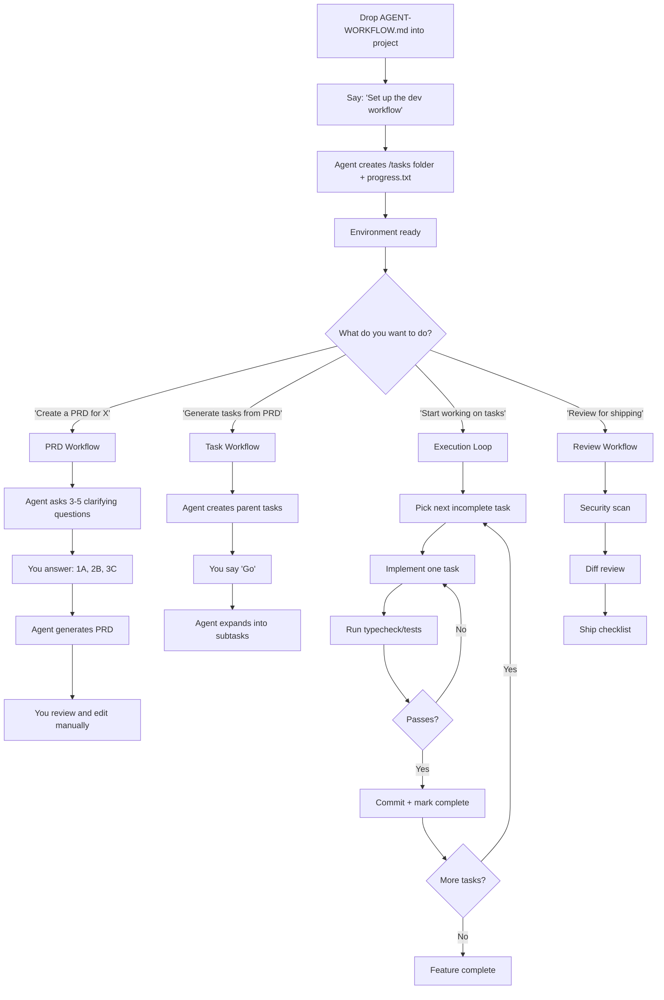

# AI Development Workflow

Drop this file into any project. Point Cursor agent at it. Say "Set up the dev workflow" to initialize.

---

## Quick Reference



---

## Commands You Can Say

| Command                          | What It Does                                           |
| -------------------------------- | ------------------------------------------------------ |
| "Set up the dev workflow"        | One-time setup: creates /tasks folder and progress.txt |
| "Create a PRD for [feature]"     | Starts PRD workflow with clarifying questions          |
| "Generate tasks from [prd-file]" | Converts PRD to actionable task list                   |
| "Start working on tasks"         | Begins sequential task execution                       |
| "What's the next task?"          | Shows the next incomplete task                         |
| "Continue to next task"          | Marks current done, moves to next                      |
| "Review for shipping"            | Runs security scan and diff review                     |
| "Show progress"                  | Displays completed vs remaining tasks                  |

---

## Setup Instructions

When the user says "set up the dev workflow", execute these steps:

### 1. Create Directory Structure

```bash
mkdir -p tasks
```

### 2. Create Progress File

Create `progress.txt` with this content:

```markdown
# Development Progress Log

## Codebase Patterns

(Patterns discovered during development - add here as you learn)

---

## Session Log

(Entries added automatically as tasks complete)
```

### 3. Confirm Setup

Report to user:

```
✅ Workflow initialized!

Created:
- /tasks/ (for PRDs and task lists)
- progress.txt (for tracking learnings)

You can now say:
- "Create a PRD for [feature description]"
- "Generate tasks from [prd file]"
- "Start working on tasks"
```

---

## Workflow 1: Create PRD

**Trigger:** User says "Create a PRD for [feature]" or "I want to build [feature]"

### Step 1: Gather Context

If this is an existing codebase (not empty), first analyze:

- Authentication patterns (if auth-related)
- Database schema (if data-related)
- UI component patterns (if frontend-related)
- Existing similar features

### Step 2: Ask Clarifying Questions

Before writing any PRD content, ask 3-5 critical clarifying questions. Format them for easy response:

```
Before I write the PRD, I need to understand a few things:

1. What is the primary goal of this feature?
   A. [Option based on context]
   B. [Option based on context]
   C. [Option based on context]
   D. Other (please specify)

2. Who is the target user?
   A. All users
   B. Specific user type
   C. Admin/internal users
   D. Other (please specify)

3. What is the MVP scope?
   A. Minimal - just core functionality
   B. Standard - core + basic enhancements
   C. Full - complete feature set
   D. Other (please specify)

4. [Context-specific question]
   A. [Option]
   B. [Option]
   C. [Option]

5. [Context-specific question if needed]
   A. [Option]
   B. [Option]
   C. [Option]

Reply with your choices like: 1A, 2C, 3B, 4A
```

**Wait for user response before proceeding.**

### Step 3: Generate PRD

After receiving answers, generate the PRD with this structure:

```markdown
# PRD: [Feature Name]

## Overview

[2-3 sentences: what this feature does and why it matters]

## Goals

- [Specific, measurable goal 1]
- [Specific, measurable goal 2]
- [Specific, measurable goal 3]

## User Stories

### US-001: [Story Title]

**Description:** As a [user type], I want [capability] so that [benefit].

**Acceptance Criteria:**

- [ ] [Specific, testable criterion]
- [ ] [Specific, testable criterion]
- [ ] Typecheck passes
- [ ] [If UI: Verify in browser]

### US-002: [Story Title]

**Description:** As a [user type], I want [capability] so that [benefit].

**Acceptance Criteria:**

- [ ] [Specific, testable criterion]
- [ ] [Specific, testable criterion]
- [ ] Typecheck passes

[Continue for each story - aim for stories completable in <1 day]

## Functional Requirements

- FR-1: [Explicit requirement]
- FR-2: [Explicit requirement]
- FR-3: [Explicit requirement]

## Non-Goals (Out of Scope)

- [What this feature will NOT do]
- [Boundary to prevent scope creep]

## Technical Considerations

- [Existing patterns to follow]
- [Dependencies or constraints]
- [Integration points]

## Success Metrics

- [How we know this succeeded]

## Open Questions

- [Anything still unclear]
```

### Step 4: Save PRD

Save to: `tasks/prd-[feature-name].md` (use kebab-case)

### Step 5: Prompt Review

Tell the user:

```
✅ PRD saved to tasks/prd-[feature-name].md

⚠️ IMPORTANT: Please review and edit the PRD before generating tasks.
Check that:
- Each user story is small enough (completable in <1 day)
- Acceptance criteria are specific and testable
- Non-goals clearly define boundaries
- Technical considerations match your codebase

When ready, say: "Generate tasks from tasks/prd-[feature-name].md"
```

---

## Workflow 2: Generate Tasks

**Trigger:** User says "Generate tasks from [prd-file]" or "Create tasks for [feature]"

### Step 1: Read PRD

Read the specified PRD file from /tasks/ directory.

### Step 2: Generate Parent Tasks

Create high-level parent tasks and present them:

```
Based on the PRD, here are the parent tasks:

- [ ] 0.0 Create feature branch
- [ ] 1.0 [First major milestone]
- [ ] 2.0 [Second major milestone]
- [ ] 3.0 [Third major milestone]
- [ ] 4.0 [Testing/verification]
- [ ] 5.0 [Final integration]

Ready to expand into subtasks? Reply "Go" to continue.
```

**Wait for user to say "Go" before proceeding.**

### Step 3: Expand Subtasks

After user confirms, expand each parent task:

```markdown
## Relevant Files

- `path/to/file1.ts` - [Why relevant]
- `path/to/file2.tsx` - [Why relevant]
- `path/to/file1.test.ts` - Tests for file1

## Tasks

- [ ] 0.0 Create feature branch
  - [ ] 0.1 Create branch: `git checkout -b feature/[feature-name]`

- [ ] 1.0 [Parent Task Title]
  - [ ] 1.1 [Specific subtask]
  - [ ] 1.2 [Specific subtask]
  - [ ] 1.3 [Specific subtask]

- [ ] 2.0 [Parent Task Title]
  - [ ] 2.1 [Specific subtask]
  - [ ] 2.2 [Specific subtask]

[Continue for all parent tasks]

## Notes

- Run `npm run typecheck` after each task
- For UI changes, verify in browser before marking complete
- Commit after each parent task completes
```

### Step 4: Save Task List

Save to: `tasks/tasks-[feature-name].md`

### Step 5: Confirm

```
✅ Task list saved to tasks/tasks-[feature-name].md

To start implementation, say: "Start working on tasks"
```

---

## Workflow 3: Execute Tasks

**Trigger:** User says "Start working on tasks" or "Continue working" or "What's the next task?"

### Execution Rules

1. **One task at a time** - Never work on multiple tasks in parallel
2. **Verify before marking complete** - Run typecheck/tests, check in browser for UI
3. **Commit after each parent task** - Small, focused commits
4. **Update progress.txt** - Log learnings after completing tasks
5. **Check off tasks** - Update the task file as you complete items

### Execution Loop

````
For each incomplete task:
  1. Announce: "Working on task [X.Y]: [description]"
  2. Implement the task
  3. Run verification:
     - `npm run typecheck` (or project equivalent)
     - `npm test` (if tests exist)
     - Browser verification (if UI change)
  4. If verification fails:
     - Fix issues
     - Re-run verification
     - Repeat until passing
  5. Mark task complete in tasks/tasks-[feature].md
  6. If parent task complete:
     - Commit: `git add -A && git commit -m "feat: [parent task description]"`
  7. Log to progress.txt:
     ```
     ## [Date] - Task [X.Y]
     - Completed: [what was done]
     - Files: [files changed]
     - Learnings: [anything notable]
     ---
     ```
  8. Report: "✅ Task [X.Y] complete. [N] tasks remaining."
  9. Ask: "Continue to next task?"
````

### Browser Verification (For UI Tasks)

When a task involves UI changes:

1. Use browser tools to navigate to the relevant page
2. Take a snapshot to verify elements exist
3. Interact with the new UI elements
4. Confirm expected behavior
5. Screenshot if helpful for documentation

### Handling Failures

If typecheck or tests fail:

1. Analyze the error
2. Fix the issue
3. Re-run verification
4. Only proceed when passing

Never mark a task complete if verification fails.

### Progress Reporting

When user asks "Show progress":

```
📊 Progress Report

Feature: [feature name]
Branch: feature/[name]

Completed: [X] / [Total] tasks
├── ✅ 0.0 Create feature branch
├── ✅ 1.0 [Completed parent]
│   ├── ✅ 1.1 [Subtask]
│   └── ✅ 1.2 [Subtask]
├── 🔄 2.0 [In progress parent]
│   ├── ✅ 2.1 [Completed]
│   └── ⬜ 2.2 [Next up]
└── ⬜ 3.0 [Not started]

Next task: 2.2 - [description]

Say "Continue to next task" to proceed.
```

---

## Workflow 4: Review & Ship

**Trigger:** User says "Review for shipping" or "Ready to ship" or "Security review"

### Step 1: Security Scan

Review all changed files for:

```
🔒 Security Review Checklist

Authentication & Authorization:
- [ ] All endpoints require appropriate auth
- [ ] User can only access their own data
- [ ] Admin functions properly restricted

Data Handling:
- [ ] Input validation on all user inputs
- [ ] No SQL injection vulnerabilities
- [ ] No XSS vulnerabilities
- [ ] Sensitive data not logged

Secrets & Config:
- [ ] No hardcoded secrets
- [ ] No API keys in code
- [ ] Environment variables used properly

Dependencies:
- [ ] No known vulnerable packages
- [ ] Dependencies from trusted sources
```

### Step 2: Diff Review

Summarize all changes:

```
📝 Change Summary

Files Changed: [count]
Lines Added: [+count]
Lines Removed: [-count]

Key Changes:
1. [Component/file]: [What changed and why]
2. [Component/file]: [What changed and why]
3. [Component/file]: [What changed and why]

Potential Risks:
- [Any risky changes to flag]

Database Changes:
- [Any migrations or schema changes]
```

### Step 3: Ship Checklist

```
🚀 Ship Checklist

Pre-merge:
- [ ] All tasks complete
- [ ] All tests passing
- [ ] Typecheck passing
- [ ] Security review complete
- [ ] PR description written
- [ ] Self-review of diff complete

Post-merge:
- [ ] Verify in staging/production
- [ ] Monitor for errors
- [ ] Update documentation if needed
```

### Step 4: Generate PR Description

```markdown
## Summary

[Brief description of what this PR does]

## Changes

- [Change 1]
- [Change 2]
- [Change 3]

## Testing

- [How this was tested]
- [Browser verification completed for UI changes]

## Checklist

- [x] Typecheck passes
- [x] Tests pass
- [x] Security review complete
- [x] Self-review complete
```

---

## Progress File Format

The `progress.txt` file persists learnings between sessions:

```markdown
# Development Progress Log

## Codebase Patterns

(Add patterns here as you discover them)

- Pattern: [description]
- Convention: [description]

---

## Session Log

## [Date] - Task 1.1: [Title]

- Completed: [what was done]
- Files: [files changed]
- Learnings: [patterns discovered, gotchas encountered]

---

## [Date] - Task 1.2: [Title]

- Completed: [what was done]
- Files: [files changed]
- Learnings: [patterns discovered, gotchas encountered]

---
```

### Using Progress File

At the start of each session:

1. Read progress.txt
2. Check "Codebase Patterns" section for important context
3. Review recent entries to understand current state

After completing tasks:

1. Append entry to Session Log
2. If you discovered a reusable pattern, add to Codebase Patterns section

---

## Task Sizing Guide

### Right-Sized Tasks (< 1 day, fits in one context)

- Add a database column + migration
- Create a single UI component
- Implement one API endpoint
- Add form validation
- Write tests for one module
- Add a filter to existing list

### Too Big (Split These)

- "Build the dashboard" → Split by component
- "Add authentication" → Split: schema, middleware, UI, session
- "Refactor the API" → Split by endpoint
- "Add user management" → Split: list, create, edit, delete, permissions

### Splitting Strategy

```
Too Big: "Add user settings page"

Split Into:
1. Create settings page route and layout
2. Add profile section with name/email fields
3. Add password change section
4. Add notification preferences section
5. Add account deletion section
6. Write tests for settings API
```

---

## Troubleshooting

### "Task is too complex"

Split it into smaller subtasks. Each task should be describable in 2-3 sentences.

### "Tests keep failing"

1. Read the error carefully
2. Check if it's a real bug or test environment issue
3. Fix the root cause, not just the symptom
4. Re-run until green

### "Lost track of progress"

1. Check `tasks/tasks-[feature].md` for checkbox status
2. Check `progress.txt` for session log
3. Check git log for commits

### "Feature scope creeping"

1. Check PRD "Non-Goals" section
2. If new requirement is essential, update PRD first
3. Add new tasks explicitly, don't expand existing ones

---

## Best Practices

1. **Always review PRD manually** before generating tasks
2. **Keep tasks small** - if you can't finish in one session, split it
3. **Verify every UI change** in the browser before marking complete
4. **Commit frequently** - one commit per parent task minimum
5. **Log learnings** - future you will thank past you
6. **Don't skip security review** - assume bugs exist until proven otherwise

---

## Quick Setup Checklist

When dropped into a new project:

- [ ] Say "Set up the dev workflow"
- [ ] Verify /tasks folder created
- [ ] Verify progress.txt created
- [ ] Ready to create first PRD

---

## Notes

- use tsc not typecheck command
