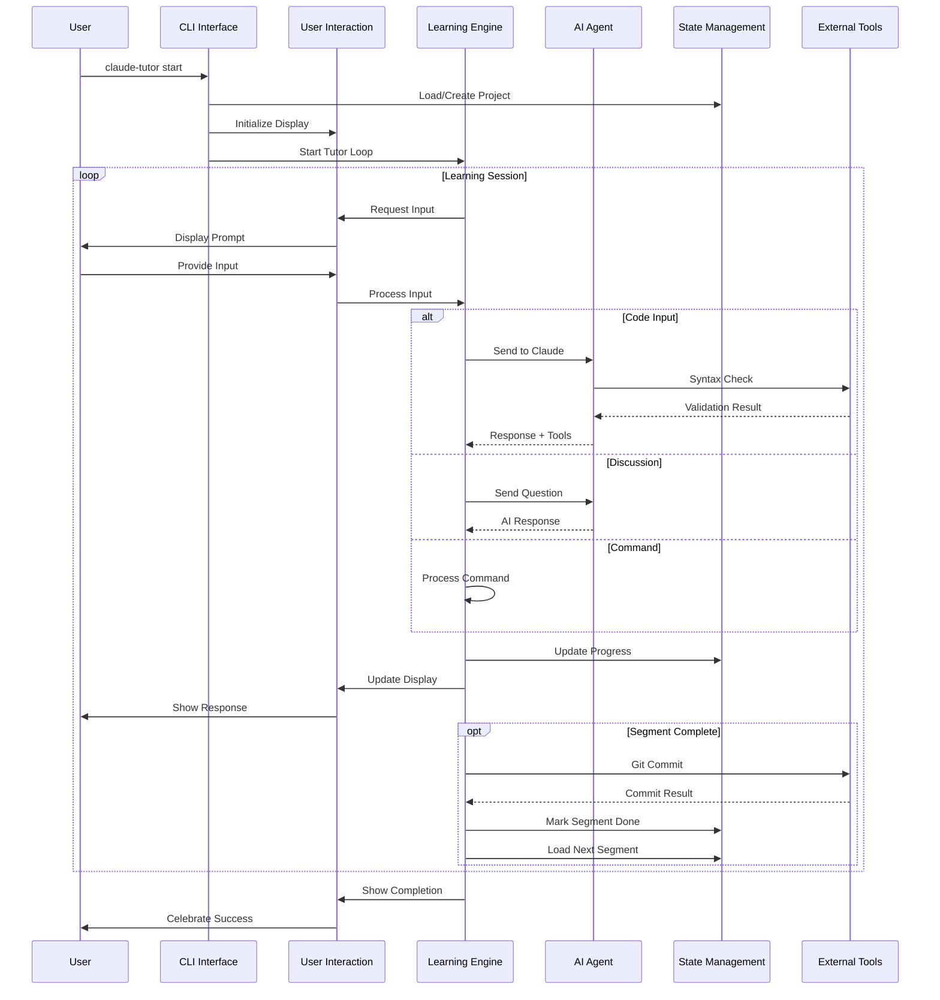

# Claude Code Tutor - System Diagrams

## System Architecture Overview

## Data Flow Architecture

## User Interaction Patterns

## Component Interaction Detail

## System State Transitions

## Technology Integration Map

